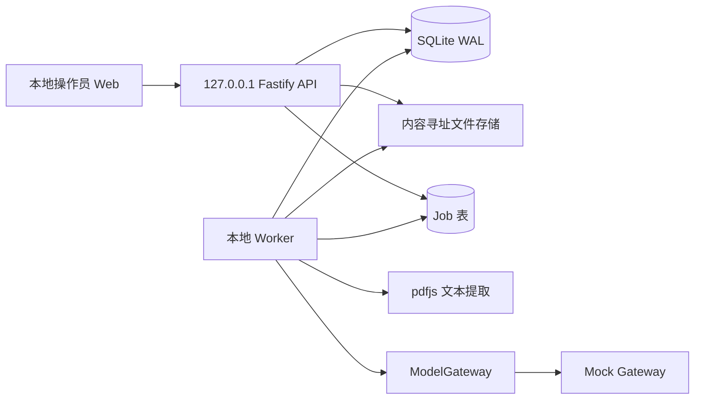

# Wave 1 Technical Plan

## 状态校正说明（2026-07-15）

本文主体记录的是 Wave 1 第一批启动方案及其历史 Gate 记录；当前实际实施状态以
`docs/CURRENT_STATE.md` 和 `docs/devlog/2026-07-15.md` 为准。SQLite、PDF、
Mock/BYOK、快速问答 Workflow API、最小 Web 和 `guided-learning.v1` 契约已有部分
进入 main；`guided-learning.v1` runtime 尚未进入 main。API/SQLite runtime 已由主控
作为独立任务 T-W1-013 授权并在隔离 worktree 中推进，当前尚未集成；Worker、Web
runtime 和端到端验收仍未实现。原有 Gate 表格和历史决策记录保留，不因本次同步改写为整体开放。

- 状态：`FROZEN_FOR_FIRST_BATCH_REPAIR_PENDING_REVIEW`
- 产品范围：`APPROVED_BY_HUMAN`
- Gate A 技术方案冻结：`REPAIR_REVIEW_PENDING`
- Gate B 编码授权：`GRANTED`
- Gate C 业务任务解锁：`LOCKED`
- 主控 Agent：Orchestrator
- 独立 QA owner：`qa-evaluation-agent`
- 关联 RFC：`RFC-W1-001`
- 适用范围：Wave 1“方法学习”最小产品闭环

## 1. 技术启动结论与版本基线

Wave 1 建议冻结为 Node.js 24 LTS、TypeScript 全栈、Fastify API、独立轮询 Worker、React/Vite Web、SQLite + 内容寻址文件存储、`pdfjs-dist` 文本提取和 JSON Schema/Ajv 契约校验。Node 24作为更新的LTS目标基线；Node 22仍处于LTS支持期。Wave 0 的 Node 22 只作为迁移前基线，不作为 Wave 1 的目标版本。

本轮仅执行 T-W1-001、T-W1-002、T-W1-007。真实业务运行时（PDF、SQLite、Mock Gateway、BYOK HTTP、工作流 API 和 Web 闭环）继续锁定，不因本批次完成而自动进入下一批。

## 2. 三个独立 Gate

三个 Gate 不互相循环依赖，也不要求先实现业务才能通过技术冻结。

| Gate | 目的 | 通过条件 | 产物/状态变化 | 当前状态 |
|---|---|---|---|---|
| Gate A：技术方案冻结 | 冻结运行时、部署边界、公共契约、状态机、数据/隐私边界、QA 和回滚策略 | RFC-W1-001 获契约 owner、独立 QA owner、主控签字；契约版本和 ownership 无冲突；不要求业务实现 | 技术提案/RFC `PROPOSED → ACCEPTED`；任务仍为 `DRAFT` | `REPAIR_REVIEW_PENDING` |
| Gate B：编码授权 | 允许本次已批准第一批范围执行 | 人类项目负责人明确批准第一批范围；外部模型和隐私边界无新增重大风险 | 编码授权从 `NOT_GRANTED → GRANTED` | `GRANTED（仅第一批）` |
| Gate C：业务任务解锁 | 允许某个具体任务从规划进入可分配状态 | Gate B 已通过；任务依赖、写路径、契约版本、验收、测试、回滚和 owner 齐全；QA 复核计划已登记 | 选定任务从 `DRAFT → READY`，之后才可 `ASSIGNED` | `LOCKED` |

Gate A 可以在零业务实现状态下完成；Gate B 不自动由 Gate A 触发；Gate C 也不因 Gate B 通过而批量解锁。本次整改仅将 T-W1-001/T-W1-002 置为 `REVIEW`、T-W1-007 保持 `PARTIAL`；其余任务继续 `DRAFT/LOCKED`。

## 3. 技术栈决策

| 层 | Wave 1 建议 | 选择理由 | 暂不选择 |
|---|---|---|---|
| Runtime | Node.js 24 LTS，TypeScript，ESM | 延续 Wave 0 Node 生态，同时以更新的 LTS 作为目标基线 | 不引入第二套 Python 运行时 |
| API | Fastify + JSON Schema/Ajv | Schema 校验明确，适合契约测试和小型 API | 不让领域逻辑直接依赖 HTTP 框架 |
| Web | React + Vite + TypeScript | 足以承载项目、导入、问题/回答确认状态 | 不引入复杂全局状态平台 |
| Worker | 独立 Node 进程，SQLite job 表轮询 | 不需要 Redis，能实现 claim、lease、重试和恢复 | 不做无界重试或多节点调度 |
| 数据库 | SQLite，SQL migration，仓储接口 | 单用户工作台、低运维、CI 易隔离 | 不为未批准的多用户规模预置 PostgreSQL |
| 文件存储 | 本地内容寻址目录，SHA-256 对象键 | 原始 PDF 可校验、去重和备份 | 不接入云对象存储 |
| PDF | `pdfjs-dist`，按页提取和规范化文本 | 保留页边界，便于证据定位；不需要 OCR | 不使用 OCR 或视觉理解 |
| 契约 | JSON Schema Draft 2020-12 + Ajv | API、ModelGateway、任务和错误结构统一 | 不复制未版本化字段 |
| 测试 | Vitest、契约/SQLite 集成、Playwright、固定评测 | 覆盖确定性逻辑、闭环、浏览器和模型输出 | 不把模型自评作为唯一基准 |
| 质量工具 | Biome、TypeScript `noEmit`、npm audit、secret/license scan | 失败显式阻断，适配单仓库 CI | 不继续把 Wave 0 占位脚本当作真实质量门槛 |

平台任务负责把 Wave 0 Node 22 CI 基线迁移到 Node 24 LTS。依赖新增、替换或升级必须记录来源、许可证、维护责任和 lockfile 变更。

## 4. Wave 1 部署边界与认证主体

Wave 1 只支持本地部署边界：

- API 仅监听 `127.0.0.1`，默认端口由环境变量配置；禁止绑定 `0.0.0.0`、局域网地址或公网地址。
- Web 开发服务器和 Worker 只接受本机进程/本机 API 连接；不提供远程部署、反向代理、云服务或多用户访问配置。
- Wave 1 的认证主体是“运行该本地工作台的本地操作员（local operator）”，其安全边界是操作系统账户、本机文件权限和 loopback 监听，不是假设存在的远程用户身份。
- 服务端仍检查 workspace-local `project_id` 与本地工作区绑定，防止跨项目 ID 误读；这不是远程身份认证，也不得表述为无认证主体的“项目级授权”。
- 外部模型同意记录属于本地操作员对指定项目的明确操作记录，保存时间、配置的 provider 标识、发送内容摘要和撤销状态；不能伪造为远程用户授权。
- 若未来需要远程部署，必须新增部署/认证 RFC，明确认证主体、会话、CSRF、TLS、密钥、审计和多用户隔离；未获批准前不能开放远程监听。

## 5. 运行与数据流



导入和模型生成均作为可观察任务执行。API 只创建任务和读取结果，Worker 负责原子 claim、lease、续租、幂等、超时、重试和失败状态。Wave 1 不引入外部消息队列。

## 6. SQLite、Job 和崩溃恢复

### 6.1 SQLite 运行参数

- 数据库初始化必须设置 `PRAGMA journal_mode=WAL`、`PRAGMA foreign_keys=ON` 和 `PRAGMA busy_timeout=5000`。
- 采用事务和版本化 SQL migration；`synchronous=NORMAL` 只在已启用原子备份和恢复演练后使用，否则使用更保守设置。
- 使用 `wal_autocheckpoint=1000` 页作为自动 checkpoint 目标；Worker 每 5 分钟执行一次 `wal_checkpoint(PASSIVE)`，干净关闭或备份窗口在确认无活跃写事务后执行 `wal_checkpoint(TRUNCATE)`。
- WAL、主数据库和临时文件必须位于同一受权限保护的本地数据目录；备份不通过复制未完成的临时文件实现。

### 6.2 原子 job claim 和 lease

Worker 使用 `BEGIN IMMEDIATE` 事务完成 claim：选择一个 `QUEUED` 任务或 lease 已过期的可恢复任务，原子更新 `state=RUNNING`、`worker_id`、`attempt`、`lease_until` 和 `started_at`，提交后才开始外部工作。任务的幂等键和唯一约束保证重复 claim 不重复发布结果。

初始参数：lease 60 秒，Worker 每 20 秒续租一次；续租失败立即停止发布结果并重新读取任务状态。Worker 崩溃后，启动恢复器把 `RUNNING` 且 `lease_until < now` 的任务按 retry policy 重新置为 `QUEUED`，或在达到上限后置为 `FAILED`。恢复动作必须写审计事件。

### 6.3 Job 状态迁移表

| 当前状态 | 事件/条件 | 下一状态 | 约束和副作用 |
|---|---|---|---|
| `QUEUED` | Worker 在事务中成功 claim | `RUNNING` | 增加 `attempt`，写 `worker_id`、lease 和开始时间 |
| `QUEUED` | 用户取消且尚未 claim | `CANCEL_REQUESTED` | 不启动新处理；保留幂等键 |
| `RUNNING` | 业务成功并提交输出 | `SUCCEEDED` | 先事务写完整输出，再发布完成状态 |
| `RUNNING` | 可重试错误且 `attempt < max_attempts` | `QUEUED` | 写 `failure_class=RETRYABLE`、`next_run_at` 和退避原因 |
| `RUNNING` | 不可重试错误或达到上限 | `FAILED` | 写稳定错误码、attempt、结束时间；不自动重放 |
| `RUNNING` | 收到取消请求 | `CANCEL_REQUESTED` | 处理器协作式停止，不能保证立即中断外部调用 |
| `CANCEL_REQUESTED` | 处理器安全退出/lease 恢复器确认停止 | `CANCELLED` | 不发布业务输出，写取消事件 |
| `CANCEL_REQUESTED` | 仍有不可中断调用 | `CANCEL_REQUESTED` | 继续观察 lease；超时后按失败/取消恢复策略处理 |
| `FAILED` | 用户显式重试且策略允许 | `QUEUED` | 增加 retry request 事件，不覆盖历史错误 |
| `SUCCEEDED`/`CANCELLED` | 任意再次执行请求 | 不变 | 返回幂等结果或明确冲突，不创建副作用 |

不允许直接从 `RUNNING` 写 `SUCCEEDED` 而不先事务提交输出；不允许无限重试；`FAILED` 与 `CANCELLED` 是终态，只有显式用户重试可重新进入 `QUEUED`。

### 6.4 崩溃恢复和 checkpoint

启动时依次检查 SQLite integrity、迁移版本、WAL 恢复结果和过期 leases；恢复失败则 API 进入只读错误状态，不能继续接收上传或模型任务。干净关闭先停止 claim/续租，再完成 checkpoint 和 SQLite online backup。临时上传/提取目录由 `finally` 清理，启动 sweeper 删除超过 1 小时且没有活跃任务引用的临时文件。

## 7. PDF 处理、资源上限和证据定位

### 7.1 输入和资源限制

| 项目 | Wave 1 初始上限/策略 |
|---|---|
| 原始 PDF 大小 | 50 MiB，超过即 `FILE_TOO_LARGE` |
| 最大页数 | 300 页，超过即 `PAGE_LIMIT_EXCEEDED` |
| 最大 canonical 文本量 | 10,000,000 个 Unicode code points，超过即 `TEXT_LIMIT_EXCEEDED` |
| 提取总超时 | 30 秒，超时即 `EXTRACTION_TIMEOUT` |
| 单文档 Worker 内存预算 | 256 MiB；进程运行上限由平台任务配置并监控，超限即失败 |
| 加密 PDF | 不请求密码、不绕过加密，进入 `ENCRYPTED_UNSUPPORTED` |
| 损坏/解析失败 PDF | 进入 `INVALID_PDF` 或 `EXTRACTION_FAILED`，不触发模型 |
| 临时文件 | 仅存受保护临时目录；成功转存后立即删除，异常由 finally + 启动 sweeper 清理 |

API 在写入永久对象前检查扩展名、声明 MIME、magic bytes、大小和文件名；原始文件以 UTF-8 以外的二进制原样计算 hash。Worker 只对通过输入检查的 PDF 解析。

### 7.2 提取 profile 和 `canonical_page_text`

Wave 1 冻结 `pdfjs-text-v1` profile：

- 使用固定的 `pdfjs-dist` 版本，并记录实际版本号；按 PDF 页码 1-based 处理 text items，保持阅读顺序。
- 将 text items 合并为页面字符串；行边界规范化为 LF（`\n`），不做自动去连字符，不把页眉/页脚静默删除。
- 对整个页面执行 Unicode NFKC；连续水平空白折叠为一个 ASCII 空格；去除每行首尾 ASCII 空格；去除页面末尾多余 LF；不加入 BOM。
- 规范化后的字符串定义为 `canonical_page_text`，所有检索、quote 和 offset 均基于它，而不是基于原始 text item 或 UI 显示文本。
- `extraction_profile` 是结构化元数据，至少包含 profile 名称、版本、pdfjs 版本、text item 排序策略、NFKC 规则、空白/换行规则、连字符策略、offset 单位和 hash 编码规则。

可提取性初始门槛：总 canonical 文本至少 500 个 Unicode code points，且至少 60% 页面各有 40 个 code points。未达到门槛进入 `UNSUPPORTED_INPUT`；不执行 OCR。复杂表格和公式只按线性文本处理，并在 UI 中显示限制。

### 7.3 EvidenceSpan 的规范坐标

每个 EvidenceSpan 必须绑定 `document_version_id`、`page_number`、`canonical_page_text_sha256`、`extraction_profile` 和规范坐标：

- offset 单位是 Unicode code points（Unicode scalar values），不是 UTF-8 bytes，也不是 JavaScript UTF-16 code units。
- `char_start` 包含，`char_end` 不包含，区间为 `[char_start, char_end)`；`0 <= start < end <= codePointLength(canonical_page_text)`。
- `quote` 是该右开区间从 `canonical_page_text` 按 code point 截取出的精确连续子串；不得添加省略号、翻译、去空格或其他改写。
- `canonical_page_text_sha256` 是 `canonical_page_text` 的 UTF-8 编码字节的 SHA-256，输出为小写 64 位十六进制字符串；原始 PDF 的 SHA-256 是原始二进制字节的同样编码。
- 服务端在物化和确认前验证页面存在、profile 匹配、hash 匹配、区间合法且 quote 等于该区间；失败则 `verification_status=INVALID`。
- 文档重新导入或 profile 升级产生新 `document_version`；旧 EvidenceSpan 不自动迁移。

## 8. 数据存储、隐私和本地操作员边界

最小持久化模型：`projects`、`document_versions`、`document_pages`、`jobs`、`question_plans`、`question_revisions`、`answer_drafts`、`answer_revisions`、`evidence_spans`、`model_runs` 和 `audit_events`。原始 PDF/派生对象进入内容寻址目录，SQLite 保存对象键和元数据；Wave 1 不建立正式研究资产库。

- 默认 Mock；本地开发和 CI 不需要外部凭据。
- 真实外部请求必须有本地操作员对指定项目的明确同意，且 UI 先说明发送内容、provider 配置和供应商保留政策。
- 发送边界是规范化文本或回答所需 context spans；不发送原始 PDF 二进制、项目名、文件路径、内部 ID、审计日志或用户身份资料。
- 日志只记录 provider/model、Schema/prompt 版本、token/cost 元数据、延迟、状态和 hash，不记录原文、完整 prompt、密钥或完整响应。
- 请求有输入字符上限、输出 token 上限、30 秒超时、最多一次安全重试和预算阈值；超过预算进入 `BUDGET_EXCEEDED`。

## 9. ModelGateway 与证据物化

### 9.1 Wave 1 适用范围

Wave 1 必须包含 `ModelGateway.v1`、确定性 `MockModelGateway`、统一 OpenAI-compatible BYOK 适配器、OpenAI/Gemini/Groq/OpenRouter 预设、自定义 `base_url`/模型名称、配置验证和连接测试。真实 BYOK 生成问题计划与证据化回答属于 Wave 1 人工验收能力，但真实外部调用不进入普通 CI。

Mock 用于 CI、自动测试、无网络开发、确定性失败场景以及前端/状态机开发；真实适配器用于用户实际使用、本地人工产品验收，以及验证结构化输出和证据引用能力。平台不提供共享密钥；用户密钥只来自环境变量或当前运行会话内存，重启后可要求重新输入。

BYOK 配置与密钥分离：持久化配置只保存 provider、base_url、model、超时和 token/字符上限；每个真实 BYOK request 只在顶层接收一个 `runtime_secret_ref`，Mock request 不携带该字段。secret ref 仅指向运行时环境变量且不包含明文密钥，不写入 SQLite、Git、日志、审计、导出或 fixture。浏览器不得直连供应商，调用必须经过本地后端。

### 9.2 Gateway 契约

```text
ModelGateway.v1
  REQUEST  GENERATE_QUESTION_PLAN(QuestionPlanInput)
  RESPONSE GENERATE_QUESTION_PLAN(QuestionPlanDraft)
  REQUEST  GENERATE_ANSWER(AnswerInput)
  RESPONSE GENERATE_ANSWER(AnswerDraft)
  REQUEST/RESPONSE CONNECTION_TEST
```

request 与 response 是以 `message_kind` 和 `operation` 区分的完整 union；request 不含 output，response 不含 input。模型不得生成最终 `char_start`/`char_end`。服务端先把检索结果切成带服务端生成的 `context_span_id` 的 ContextSpan，再把 `context_span_id + text` 提供给模型。模型输出只能返回：

- `context_span_id`；或
- 包含一个或多个 `context_span_id` 的候选引用；可附带候选 quote，但不具有坐标权威。

服务端根据 `context_span_id` 查找对应 canonical 页面文本，物化最终 EvidenceSpan，计算 `[start,end)`、quote 和 SHA-256，并重新验证。模型返回不存在的 span、跨 span 的 offset 或无法匹配的 quote 都被拒绝；不能由模型直接写入最终 EvidenceSpan。

`QuestionPlanDraft` 只含语言、检索词和问题文本；`AnswerDraft` 只含文本、claim type 和候选 context refs。正式计划、问题、revision、claim ID、时间、hash 和 review/verification 状态均由服务端物化。SUCCESS 至少有一个带候选引用的普通 claim；`INSUFFICIENT_EVIDENCE` 不含候选引用且不能混合普通 claim。论文文本是数据，不得覆盖系统指令、Schema、权限或工具调用。

实现分为：

- `MockModelGateway`：固定 fixture + deterministic seed，覆盖成功、无效 Schema、无效 context span、无证据、超时、预算超限和失败。
- `GatewayValidator`：校验 Schema、context 引用、断言类型、长度、拒答规则和服务端 Evidence 物化结果。
- `OpenAICompatibleBYOKGateway`：统一 HTTP 适配器，通过用户运行时 secret 调用兼容端点；预设只提供安全默认 base URL，custom provider 必须使用 HTTPS。连接测试只返回脱敏状态和错误码。

## 10. 公共契约、语言检索和状态机

Wave 1 公共契约基线为 `wave1.v1`，细分契约必须带版本字段：`api.v1`、`document.v1`、`job.v1`、`question-plan.v1`、`answer.v1`、`evidence.v1`、`model-gateway.v1`。

### 10.1 question-plan.v1 的语言与检索字段

`question-plan.v1` 必须增加：

- `document_language`：论文主要语言的 BCP-47 标签，例如 `en` 或 `zh-Hans`。
- `retrieval_queries`：面向论文语言的完整检索短语数组；中文问题、英文论文时必须包含英文检索短语。
- `retrieval_terms`：面向论文语言的词/短语数组，用于确定性词法检索；保留短语顺序和大小写折叠规则。

这些字段是检索提示，不是证据；最终 context spans 仍由服务端根据 document version 生成。问题文本可以是中文，论文文本可以是英文，模型或规则必须显式产出目标语言检索词，不能假设两者字面相同。

### 10.2 Question 和 Answer 的 revision/review/verification

`MODIFIED` 不再是稳定状态，而是一次修订事件。每次模型生成或用户编辑都追加不可变 revision：`revision_id`、`revision_number`、`created_by`（`MODEL`/`LOCAL_OPERATOR`）、`created_at`、内容 hash 和 `supersedes_revision_id`。

问题和回答分别有：

- `review_status`：`DRAFT | CONFIRMED | REJECTED`。
- `verification_status`：问题为 `NOT_REQUIRED`；回答为 `PENDING | VERIFIED | INVALID | INSUFFICIENT_EVIDENCE`。

问题流程：生成 revision → `review_status=DRAFT` → 本地操作员确认或拒绝；用户编辑追加 revision 并将 review status 保持/重置为 `DRAFT`，不写入 `MODIFIED` 状态。回答流程：生成 revision → `review_status=DRAFT, verification_status=PENDING` → 服务端证据验证为 `VERIFIED/INVALID/INSUFFICIENT_EVIDENCE` → 本地操作员确认或拒绝；用户编辑追加 revision、重置 review 为 `DRAFT` 和 verification 为 `PENDING`，确认必须同时满足 `review_status=CONFIRMED` 与 `verification_status=VERIFIED`。未经确认的内容仍不是正式研究资产。

### 10.3 Job 状态

Job 状态和正式迁移表见第 6.3 节；契约固定为 `QUEUED`、`RUNNING`、`SUCCEEDED`、`FAILED`、`CANCEL_REQUESTED`、`CANCELLED`，重试通过 `attempt`、`failure_class` 和 `next_run_at` 表达，不新增含义模糊的 `RETRYING` 状态。

### 10.4 V1.0 引导式学习技术细化（待 RFC-W1-002 审查）

V1.0 产品定义已归档，开发基线见 `docs/product/v1.0-development-requirements.md`。现有第一轮基础能力继续复用；后续业务轮次需要在不破坏快速问答兼容性的前提下增加：学习目标、2–3 个候选方向、固定三阶段路线、第一阶段 3–7 道顺序问题、作答/跳过、点评、参考答案、Evidence、当前回答修正和阶段总结。

该细化会影响公共契约、工作流状态机、持久化字段和 Web 页面。RFC-W1-002 在技术审查前只记录候选方案，不改变 `wave1.v1`，不解锁 Gate C。引导式学习的 `ANALYZE` 与 `TRANSFER` 阶段必须保持服务端锁定态；快速问答继续使用问题/回答确认与正式资产边界。

## 11. QA owner、评测集和指标

### 11.1 QA 执行方式和责任

独立 QA owner 固定为 `qa-evaluation-agent`，其写路径为 `tests/evaluation/**`、`tests/fixtures/evaluation/**`、`docs/evaluation/**` 和 `docs/audits/wave1-qa/**`；不得修改实现模块。每个责任 Agent 做局部测试，QA 独立复核，主控复跑关键命令并核对 diff、ownership、边界和证据。

### 11.2 固定评测集

评测集包含公开/开放许可的文本层方法论文、双栏文本论文、扫描/无文本负例和不可回答问题，记录来源、许可证、原始 SHA-256、页数、profile、人工参考问题、断言类型、context span、证据位置和预期拒答理由。未获许可的论文原文不得提交仓库。

### 11.3 确定性门槛与产品观察指标分离

确定性 CI 门槛是合并阻断条件：格式、lint、类型、单元、契约、迁移、构建、PR Playwright smoke、secret/dependency/license scan。PR smoke 至少覆盖本地 loopback 启动、创建项目、导入许可 fixture、选择方法学习、Mock 生成问题计划、确认一个问题、生成带验证证据的回答和确认回答；失败必须阻断合并。

问题可用率、带证据回答的用户接受率、修改率、拒绝原因和完成时间是产品观察指标，不是确定性 CI 门槛。它们通过固定评测和人工审阅报告观察，不以未经测量的阈值阻断 PR，也不能被 Mock 自评替代。

## 12. CI 和开发命令

模型设置页面属于后续 Web 闭环任务（T-W1-006），不属于本批次契约/平台/评测实现。页面只能把非敏感 provider 配置发送到本地后端，并通过连接测试展示脱敏结果；API Key 输入保持内存态，不回填、不写 URL、不写普通配置响应。

技术栈冻结后，平台 owner 将 Wave 0 占位脚本替换为真实门槛：

```text
npm ci
npm run format
npm run lint
npm run typecheck
npm run test
npm run contract
npm run migration-check
npm run build
npm run e2e:smoke
npm run security
npm run ci
```

`npm run ci` 只包含确定性合并门槛，不把用户接受率或完整人工评测作为 PR 阻断项。完整 `npm run eval` 可由 QA 在受控 workflow 运行并报告指标。GitHub Actions 固定 Node 24、使用 lockfile、只缓存依赖不缓存用户数据；工具缺失必须失败或明确记录 `NOT_APPLICABLE_BY_SCOPE`。

## 13. 风险、回滚和恢复

| 风险 | 控制 | 回滚/恢复 |
|---|---|---|
| PDF profile 改变 offset | immutable document version、canonical hash、profile version | 停用新 profile，保留旧版本和原始文件 |
| 外部模型持续成本/隐私风险 | BYOK、默认 Mock、用户同意、预算/超时、脱敏日志；真实调用不进普通 CI | 关闭 provider；Mock 保持闭环 |
| 模型提示注入或无效引用 | context_span_id、服务端物化、Schema/证据验证 | 丢弃 revision，任务失败，不发布输出 |
| Job/SQLite 崩溃 | WAL、busy timeout、原子 claim、lease、backup、checkpoint | 停止 Worker，恢复一致备份，重置过期 lease |
| PDF 资源耗尽 | 页数/文本量/超时/内存限制和临时清理 | 任务 FAILED，删除临时文件，不触发模型 |
| UI 重复提交 | 幂等键、pending 状态、唯一约束 | 返回既有任务/结果，不重复副作用 |

数据库迁移必须可在空库和上一版本库运行；破坏性迁移、真实数据删除、远程开放监听和供应商数据保留变化均需暂停并按治理规则申请。

## 14. 冻结复审清单

Gate A 复审必须确认：

1. RFC-W1-001 的 reviewer sign-off 表完成，结论为接受或明确退回；
2. `wave1.v1` Schema、revision/review/verification、Job 迁移、canonical 文本和 ModelGateway 引用规则具备契约样例；
3. Node 24 LTS、`127.0.0.1` 部署边界和“无远程认证则不开放远程部署”写入平台任务；
4. SQLite WAL/claim/lease/recovery/checkpoint 和 PDF 资源限制写入实现任务；
5. T-W1-003 已拆分，T-W1-004A/004B、T-W1-006A Web 契约骨架和 T-W1-007 评测资料可以按依赖并行；
6. CI 确定性门槛与产品观察指标分离，PR smoke 已列为合并门槛。

Gate B 由人类项目负责人单独批准；Gate C 由主控逐任务解锁。本次整改不解锁 Gate C，后续任务不得自动推进。
